# AI Voice & Multimodal Streaming Integration Guide

This skill provides comprehensive instructions, code patterns, and troubleshooting steps for integrating Gemini Live / Voice Mode, bidirectional WebSocket audio streaming, and high-performance Web Audio API pipelines.

---

## 1. Connection Architecture

Gemini Live / Multimodal Bidirectional Voice Mode operates over WebSockets. The client establishes a single websocket connection to exchange audio input/output, text input/output, and tool execution messages.

### WebSocket URL Format
```text
wss://generativelanguage.googleapis.com/ws/google.ai.generativelanguage.v1alpha.GenerativeService.BidiGenerateContent?key=YOUR_API_KEY
```

### Protocol Lifecycle

```mermaid
sequenceDiagram
    participant Client as Web Client
    participant Server as Gemini Live Server
    
    Client->>Server: Connect (WebSocket)
    Client->>Server: Send "setup" message (config, model, voice, tools)
    Server-->>Client: Receive "setupComplete" message
    Note over Client,Server: Bidirectional Streaming Session Active
    
    rect rgb(20, 20, 30)
        Note over Client,Server: User Speaking
        Client->>Server: Send continuous "realtimeInput" (raw audio base64)
    end
    
    rect rgb(30, 20, 20)
        Note over Client,Server: Model Responding
        Server->>Client: Send "serverContent" (raw audio base64, text chunks)
        Server->>Client: Send "contentFinished" (end of turn)
    end
```



---

## 2. Audio Pipeline (Web Audio API)

High-performance real-time audio requires raw Linear PCM data (usually 16-bit, 16kHz or 24kHz, mono). Using standard HTML5 elements causes unacceptable latency. You **must** use an `AudioContext` and `AudioWorklet`.

### 2.1 Audio Worklet for Recording (Microphone Input)
Register an `AudioWorkletProcessor` to convert microphone float arrays to 16-bit PCM buffer packets:

```javascript
// recorder-worklet.js
class RecorderProcessor extends AudioWorkletProcessor {
  process(inputs, outputs, parameters) {
    const input = inputs[0];
    if (inputs && inputs[0] && inputs[0].length > 0) {
      const channelData = input[0]; // Mono channel
      
      // Convert Float32Array [-1.0, 1.0] to Int16Array [-32768, 32767]
      const pcmBuffer = new Int16Array(channelData.length);
      for (let i = 0; i < channelData.length; i++) {
        let val = Math.max(-1, Math.min(1, channelData[i]));
        pcmBuffer[i] = val < 0 ? val * 0x8000 : val * 0x7FFF;
      }
      
      this.port.postMessage(pcmBuffer.buffer, [pcmBuffer.buffer]);
    }
    return true;
  }
}

registerProcessor('recorder-worklet', RecorderProcessor);
```

### 2.2 Client-Side Playback (Audio Output Queue)
To play the incoming stream with minimal stutter, build an audio queue inside a playback Worklet or buffer-scheduler:

```javascript
// playback-queue.js
class PlaybackQueue {
  constructor(audioContext, sampleRate = 24000) {
    this.ctx = audioContext;
    this.sampleRate = sampleRate;
    this.nextPlayTime = this.ctx.currentTime;
    this.bufferQueue = [];
  }

  enqueue(base64Data) {
    const raw = atob(base64Data);
    const len = raw.length;
    const bytes = new Uint8Array(len);
    for (let i = 0; i < len; i++) {
      bytes[i] = raw.charCodeAt(i);
    }
    
    // Interpret as Int16PCM
    const int16 = new Int16Array(bytes.buffer);
    const float32 = new Float32Array(int16.length);
    for (let i = 0; i < int16.length; i++) {
      float32[i] = int16[i] / 32768.0;
    }
    
    this.playFloat32Buffer(float32);
  }

  playFloat32Buffer(bufferData) {
    const audioBuffer = this.ctx.createBuffer(1, bufferData.length, this.sampleRate);
    audioBuffer.copyToChannel(bufferData, 0);

    const source = this.ctx.createBufferSource();
    source.buffer = audioBuffer;
    source.connect(this.ctx.destination);

    // Schedule play time smoothly to prevent gaps
    const startTime = Math.max(this.nextPlayTime, this.ctx.currentTime);
    source.start(startTime);
    this.nextPlayTime = startTime + audioBuffer.duration;
  }
}
```

---

## 3. Communication Payloads

### 3.1 Setup Message (Client -> Server)
Send this immediately after the connection is established. It configures the model voice, output modalities, and tools.

```json
{
  "setup": {
    "model": "models/gemini-2.0-flash-exp",
    "generationConfig": {
      "responseModalities": ["AUDIO"],
      "speechConfig": {
        "voiceConfig": {
          "prebuiltVoiceConfig": {
            "voiceName": "Puck"
          }
        }
      }
    },
    "tools": [
      {
        "functionDeclarations": [
          {
            "name": "get_weather",
            "description": "Retrieve current weather information for a location.",
            "parameters": {
              "type": "OBJECT",
              "properties": {
                "location": { "type": "STRING", "description": "City name" }
              },
              "required": ["location"]
            }
          }
        ]
      }
    ]
  }
}
```

### 3.2 Real-time Audio Input (Client -> Server)
Send 16-bit PCM data chunks (mono, 16kHz or 24kHz) base64-encoded:

```json
{
  "realtimeInput": {
    "mediaChunks": [
      {
        "mimeType": "audio/pcm;rate=16000",
        "data": "base64_encoded_pcm_data_here..."
      }
    ]
  }
}
```

### 3.3 Server Content (Server -> Client)
The server returns audio and text chunks back. Listen for `serverContent` events:

```json
{
  "serverContent": {
    "modelTurn": {
      "parts": [
        {
          "mimeType": "audio/pcm;rate=24000",
          "inlineData": {
            "data": "base64_encoded_pcm_response..."
          }
        }
      ]
    }
  }
}
```

### 3.4 Tool Function Call & Response Pattern
When Gemini needs to run a function, it sends a `toolCall` payload:

```json
{
  "toolCall": {
    "functionCalls": [
      {
        "name": "get_weather",
        "id": "call_12345",
        "args": {
          "location": "Hanover, PA"
        }
      }
    ]
  }
}
```

You must execute the function locally, stop sending audio chunks temporarily, and return a `toolResponse`:

```json
{
  "toolResponse": {
    "functionResponses": [
      {
        "response": { "output": "Sunny, 72°F" },
        "id": "call_12345"
      }
    ]
  }
}
```

---

## 4. Key Performance Guidelines

- **Barge-in (Interruption Handling)**: When the client starts speaking while the model is responding, immediately stop playing audio from the output queue and send an interruption payload to the server. Clear your local buffer queue.
- **Latency Control**: Use a buffer duration of 100ms or less when packaging mic inputs. Keep WebSockets open using standard keepalive pings.
- **Sample Rate Conversions**: Ensure your microphone capture sample rate matches the expected model input sample rate (`16000` or `24000`). If your AudioContext sample rate is `44100` or `48000`, downsample it in Javascript before encoding.
- **Echo Cancellation**: Always instantiate `getUserMedia` with `echoCancellation: true` and `noiseSuppression: true` to prevent the model from hearing its own output through the microphone.
